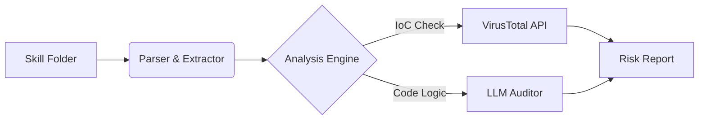

# 🛡️ Code Agent Scan

> **Security Audit Tooling for AI Agent Skills (Codex / Claude / MCP)**
>
> *Guard your AI agents against malicious extensions, backdoors, and risky dependencies.*

[](LICENSE)
[](https://www.python.org/)
[]()
[](README_zh.md)

## 📖 Overview

As AI Agents (like Codex, Claude, or Goose) become more powerful, they rely on external "Skills" or "Tools" to execute code. However, installing untrusted Skills introduces significant risks: **Remote Code Execution (RCE)**, **Data Exfiltration**, and **Persistence**.

**Code Agent Scan** is an automated security pipeline designed to audit these skills before you run them. It combines static analysis, Threat Intelligence (VirusTotal), and LLM-based logic review to detect hidden threats.

## ✨ Key Features

*   **🧠 LLM-Based Logic Audit**: Uses a local or API-based LLM to review code logic for complex threats (e.g., "Is this script trying to read `.ssh` keys?", "Does this look like a reverse shell?").
*   **🌐 Threat Intelligence**: Automatically extracts all URLs and Domains from the code and validates their reputation against **VirusTotal**.
*   **🔍 Deep Inspection**: Scans `SKILL.md` definitions and all associated scripts (`scripts/*.py`, `scripts/*.sh`, etc.).
*   **⚡ Smart Caching**: Caches API responses to minimize quota usage and speed up subsequent scans.
*   **📊 Comprehensive Reporting**: Generates both a high-level summary and a detailed line-by-line security report.

## 🏗️ Architecture



## 🚀 Quick Start

### Prerequisites

*   Python 3.10+
*   **VirusTotal API Key** (Free Public API is sufficient)

### Installation

```bash
git clone https://github.com/EaEa0001/code-agent-scan.git
cd code-agent-scan
pip install -r requirements.txt
```

### Configuration

1.  **Get a VirusTotal API Key**:
    *   Sign up for a free account at [VirusTotal](https://www.virustotal.com/).
    *   Go to your profile -> **API Key**.
    *   Copy your API Key.

2.  **Create Config File**:
    Create a `config.json` file (see `config.example.json`) with your key:

```json
{
  "VT_API_KEY": "your_virustotal_key"
}
```

### Usage

**Scan a specific skill directory:**

```bash
python main.py --target /path/to/.codex/skills/suspicious-skill
```

**Scan all installed skills:**

```bash
python main.py --scan-all --dir ~/.codex/skills
```

## 🚩 Detection Capabilities

We currently focus on detecting the following malicious patterns:

| Category | Description |
| :--- | :--- |
| **Data Exfiltration** | Attempts to read sensitive files (`.env`, `id_rsa`, `cookies`) and send them network-side. |
| **C2 Communication** | Connections to known malicious domains, dynamic DNS, or hardcoded raw IPs. |
| **Persistence** | Modifications to `.bashrc`, `.zshrc`, registry keys, or cron jobs. |
| **Obfuscation** | Use of `base64`, `eval()`, `exec()`, or packed code to hide logic. |
| **Privilege Escalation** | Usage of `sudo`, `chmod +s`, or attempts to break out of sandboxes. |

## 📝 Example Output

```text
[+] Scanning Skill: risk-scan-virustotal
----------------------------------------
[PASS] Syntax Check
[WARN] Network: Found 1 outbound domain (virustotal.com) - Reputation: CLEAN
[FAIL] Logic: Suspicious usage of 'os.system' detected in line 42.
       > Reasoning: The script takes user input and passes it directly to shell.
```

## 🤝 Contributing

Security is a community effort. We welcome malicious test cases (submit to `tests/samples`), detection rules, and core improvements.

1.  Fork the Project
2.  Create your Feature Branch (`git checkout -b feature/AmazingFeature`)
3.  Commit your Changes (`git commit -m 'Add some AmazingFeature'`)
4.  Push to the Branch (`git push origin feature/AmazingFeature`)
5.  Open a Pull Request

## ⚠️ Disclaimer

This tool is for **defensive security purposes only**. Do not use it to analyze malware on production systems without isolation. The authors are not responsible for any damage caused by the misuse of this tool.