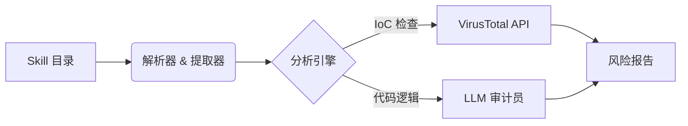

# 🛡️ Code Agent Scan

> **AI Agent Skill 安全审计工具 (Codex / Claude / MCP)**
>
> *守护您的 AI Agent，防御恶意扩展、后门及高危依赖风险。*

[](LICENSE)
[](https://www.python.org/)
[]()

## 📖 简介 (Overview)

随着 AI Agent（如 Codex, Claude, Goose）的能力日益增强，它们越来越依赖外部的“技能 (Skills)”或“工具 (Tools)”来执行代码。然而，随意安装不受信任的 Skill 会带来严重的安全隐患，包括：**远程代码执行 (RCE)**、**数据窃取**以及**持久化后门**。

**Code Agent Scan** 是一套自动化的安全流水线，专为在 Skill 运行前对其进行审计而设计。它结合了静态代码分析、威胁情报 (VirusTotal) 以及基于 LLM 的逻辑审查，能够发现隐藏的威胁。

## ✨ 核心特性

*   **🧠 基于 LLM 的逻辑审计**: 调用本地或云端 LLM 深度审查代码逻辑（例如：“这个脚本是否在尝试读取 `.ssh` 密钥？”，“这段代码看起来像反弹 Shell 吗？”）。
*   **🌐 威胁情报集成**: 自动提取代码中的所有 URL 和域名，并调用 **VirusTotal** 验证其信誉。
*   **🔍 深度检测**: 完整扫描 `SKILL.md` 定义文件及所有关联脚本（`scripts/*.py`, `scripts/*.sh` 等）。
*   **⚡ 智能缓存**: 缓存 API 响应结果，最大限度减少 API 调用额度消耗并提升二次扫描速度。
*   **📊 详尽报告**: 生成高层级的安全摘要以及逐行的详细审计报告。

## 🏗️ 架构图



## 🚀 快速开始

### 前置要求

*   Python 3.10+
*   **VirusTotal API Key** (免费的 Public API 即可)

### 安装

```bash
git clone https://github.com/EaEa0001/code-agent-scan.git
cd code-agent-scan
pip install -r requirements.txt
```

### 配置

1.  **获取 VirusTotal API Key**:
    *   前往 [VirusTotal](https://www.virustotal.com/) 注册一个免费账号。
    *   点击头像进入个人资料 -> **API Key**。
    *   复制您的 API Key。

2.  **创建配置文件**:
    创建一个 `config.json`（参考 `config.example.json`），填入您的密钥：

```json
{
  "VT_API_KEY": "您的_virustotal_key"
}
```

### 使用方法

**扫描指定的 Skill 目录：**

```bash
python main.py --target /path/to/.codex/skills/suspicious-skill
```

**扫描所有已安装的 Skill：**

```bash
python main.py --scan-all --dir ~/.codex/skills
```

## 🚩 检测能力

我们目前专注于检测以下类别的恶意行为模式：

| 类别 | 描述 |
| :--- | :--- |
| **数据窃取 (Exfiltration)** | 尝试读取敏感文件（如 `.env`, `id_rsa`, `cookies`）并将其发送到网络端。 |
| **C2 通信 (C2 Communication)** | 连接到已知的恶意域名、动态 DNS 或硬编码的原始 IP 地址。 |
| **持久化 (Persistence)** | 修改 `.bashrc`, `.zshrc`，注册表键值或 Cron 作业以实现自启动。 |
| **代码混淆 (Obfuscation)** | 使用 `base64`, `eval()`, `exec()` 或加壳代码来隐藏真实逻辑。 |
| **提权 (Privilege Escalation)** | 使用 `sudo`, `chmod +s` 或尝试逃逸沙箱环境。 |

## 📝 输出示例

```text
[+] Scanning Skill: risk-scan-virustotal
----------------------------------------
[PASS] Syntax Check
[WARN] Network: Found 1 outbound domain (virustotal.com) - Reputation: CLEAN
[FAIL] Logic: Suspicious usage of 'os.system' detected in line 42.
       > Reasoning: The script takes user input and passes it directly to shell.
```

## 🤝 贡献指南

安全需要社区的共同努力。我们欢迎大家提交恶意测试用例（提交至 `tests/samples`）、新的检测规则或核心代码改进。

1.  Fork 本项目
2.  创建您的特性分支 (`git checkout -b feature/AmazingFeature`)
3.  提交您的更改 (`git commit -m 'Add some AmazingFeature'`)
4.  推送到分支 (`git push origin feature/AmazingFeature`)
5.  发起 Pull Request

## ⚠️ 免责声明

本工具仅供**防御性安全目的**使用。请勿在未做隔离的生产环境中使用本工具分析未知恶意软件。对于因误用本工具造成的任何损坏，作者不承担任何责任。
